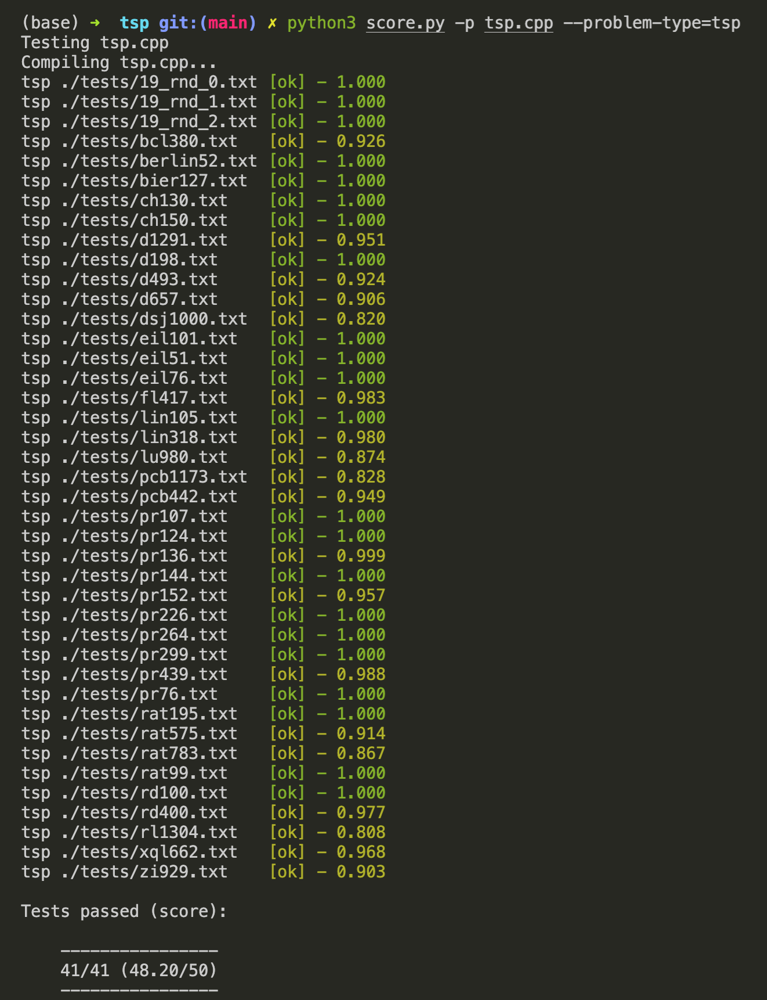

# TSP

An SLS (Stochastic Local Search) solver for TSP (Travelling Salesman Problem).

## Preface
This TSP solver started out as a school project for an NUS module (CS4234 - Optimisation Algorithms). Mainly for the assignment, we tackled the [TSP Kattis problem][kattis-tsp], trying to get as high a score as possible.

I spent lots of effort into developing this TSP solver (about close to two months of intensive development), and didn't want to see my efforts go to waste. Thus, I've made my code public for anyone who might benefit from it. Feel free to send in PRs too, or fork this repository!

As of current development, the solver has reached state-of-the-art (SOTA) performance, scoring around 48.2/50 on average on Kattis!


## Overview of TSP
TSP is an NP-hard problem, and for large number of vertices N, e.g; N = 1000, it near impossible to solve it via systematic search techniques such as brute-force, dynamic programming, as they incur exponential (non-polynomial) if not worse time-complexity.

To solve TSP for large graphs efficiently, we could use approximation algorithms such as [Christofides algorithm]. The performance of these algorithms are easy to analyse however the problem is that they can provide solutions 100% off from the optimal tour.

In comparison, SLS works well in practice returning solutions which are near optimal most of the time, about 1-2% off the optimal. However, they are hard to analyse.

## Our TSP solver
We have chosen to use ILS (Iterated Local Search) as our SLS algorithm, as it has SOTA performance for TSP.


(Image courtesy of [Steven Halim][steven])

For our subsidiary local search, we used [2-opt](https://en.wikipedia.org/wiki/2-opt) and [3-opt](https://en.wikipedia.org/wiki/3-opt) hill-climb, taking first improving neighbour.

For perturbation, we used double-bridge moves and shuffling a random segment of the tour.

Finally, our acceptance criteria is simply to accept tours with equal or better cost than the current best found. If no such tour has been found from the current hill-climb iteration, we revert to best found tour.

## Future Work
The world record for this problem is currently at 48.81/50.


Submitting this code ([`tsp.cpp`](./tsp.cpp)) verbatim gets you around 48/50 and (likely) also places you in the top 10 for this problem (I'm currently number 3!).

Generally, it's quite hard to beat this record or even improve from here. But my goal is to get as close to 50 as possible (or even 50), for this problem on Kattis! Anyone wants to join me in my quest?!

## Development and Set-up
To set up this project locally, here are the steps:

1. Clone the repository, `git clone https://github.com/nathanaelseen/tsp.git`
2. Ensure you have a C++ compiler installed. Depending on your C++ compiler/flags, you may need to modify `GCC_ARGS` under `score.py` to use the correct compiler. For instance, since I'm using the `g++-11` compiler. I just put that compiler as the first item in the list.
3. Ensure you have Python 3.6+ installed.
4. Run `pip install click sty` to install dependencies for the scoring script.
5. Run e.g. `python3 score.py -p tsp.cpp --problem-type=tsp`, and this will compile `tsp.cpp` and run the solver against our carefully curated test cases under the `/tests` folder (most of them are from [TSPLib] and the rest are [VSLI] and [national city] test cases from the University of Waterloo), and score it similar to Kattis (i.e, upon 50). You can run `python3 score.py --help` to see all options when scoring (you can configure verbosity level, glob pattern for test cases, number of jobs to run in parallel and max score).

On average, you would receive a score of around 47.5/50, which is consistently slightly lower than Kattis' test cases of 48/50. Assuming you have set-up everything correctly, you should be able to see something like this:



<details>
<summary>👨‍💻 <b>Scoring Other Problems</b> </summary>

On a side note, if you have another problem you want to score in a similar manner, you can easily adapt the scoring script to support it by implementing a `ProblemChecker` class for your problem (see the `TSPChecker` class for an example).

</details>


<details>
<summary>🤖 <b>Automating Submissions</b> </summary>

Due to the randomness involved in ILS, submitting the same code twice will likely give you two slightly different scores. A few submissions will be very lucky and a few submissions will be very unlucky. However, for this problem, only the highest score of your submissions is recorded and not the average. As such, it makes sense to make multiple submisions. We advise that you install [kattis-cli] and set it up such that it can be run from anywhere.

Then set up a [cron] job that submits the file. The command for the cronjob may look like this (adapt to your own path):

```bash
* 6,12,18,24 * * * cd /full/path/to/tsp && kattis tsp.cpp -f
```

If you choose to do this, please do not set up your system to e.g. submit every two minutes but be considerate with Kattis' limited server capability.

</details>


## Contributions

* [TSPLib] for interesting test cases as well as University of Waterloo ([VSLI] and [national city]).
* [@estan] for inspiration from his [TSP repo][estan-tsp].
* [@Lookuz] for inspiration from his [TSP repo][lookuz-tsp].


[2-opt]: https://en.wikipedia.org/wiki/2-opt
[3-opt]: https://en.wikipedia.org/wiki/3-opt
[TSPLib]: http://comopt.ifi.uni-heidelberg.de/software/TSPLIB95/
[kattis-tsp]: https://open.kattis.com/problems/tsp
[kattis-cli]: https://github.com/Kattis/kattis-cli
[cron]: https://help.ubuntu.com/community/CronHowto
[Christofides algorithm]: https://en.wikipedia.org/wiki/Christofides_algorithm
[VSLI]: https://www.math.uwaterloo.ca/tsp/vlsi/index.html
[national city]: https://www.math.uwaterloo.ca/tsp/world/countries.html
[estan-tsp]: https://github.com/estan/tsp
[lookuz-tsp]: https://github.com/Lookuz/CS4234-Stochastic-Local-Search-Methods/tree/master/TSP
[steven]: https://www.comp.nus.edu.sg/~stevenha/cs4234.html
[@estan]: https://github.com/estan
[@Lookuz]: https://github.com/Lookuz